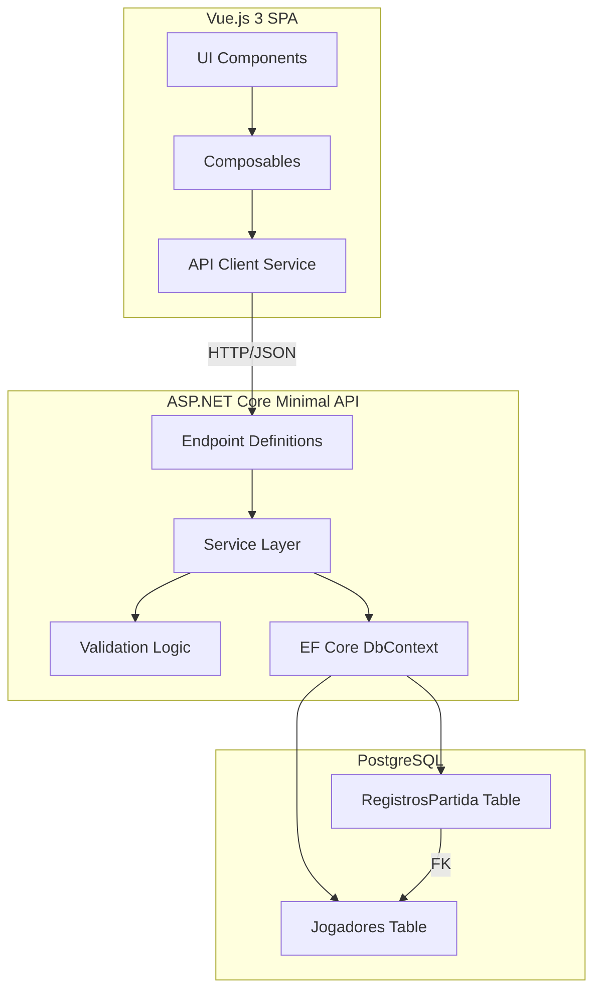
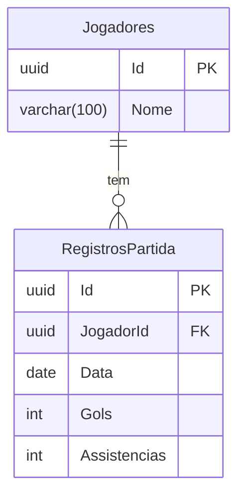

# Design Document: Football Stats Tracker

## Overview

Football Stats Tracker é uma aplicação web full-stack para registrar e visualizar estatísticas de jogos de futebol de domingo. O sistema permite o cadastro de jogadores, registro de gols e assistências por partida, correção de registros e exibição de um placar geral (leaderboard).

A arquitetura segue um modelo cliente-servidor com:
- **Back-end**: ASP.NET Core Minimal API (.NET 8) + Entity Framework Core + PostgreSQL
- **Front-end**: Vue.js 3 (Composition API) + Vite + TailwindCSS

O design prioriza simplicidade, separação de responsabilidades e validação robusta de dados.

## Architecture



### Decisões Arquiteturais

1. **Minimal API over Controllers**: Escolhido por ser mais conciso e alinhado com o .NET 8. Endpoints são agrupados via métodos de extensão `MapGroup`.
2. **Service Layer**: Toda lógica de negócio reside em classes de serviço injetáveis, separando endpoints (HTTP) de lógica de domínio e acesso a dados.
3. **Composables no Frontend**: Lógica de estado e chamadas à API encapsuladas em composables reutilizáveis (`useJogadores`, `useRegistros`, `useEstatisticas`).
4. **Validação dupla**: Validação no front-end (UX imediata) e no back-end (integridade de dados).

## Components and Interfaces

### Back-end Components

#### API Endpoints

| Método | Rota | Descrição | Response |
|--------|------|-----------|----------|
| POST | `/api/jogadores` | Cadastrar jogador | 201 + Jogador |
| GET | `/api/jogadores` | Listar jogadores | 200 + Jogador[] |
| DELETE | `/api/jogadores/{id}` | Excluir jogador + registros | 204 |
| POST | `/api/registros` | Registrar partida | 201 + RegistroPartida |
| PUT | `/api/registros/{id}` | Atualizar registro | 200 + RegistroPartida |
| DELETE | `/api/registros/{id}` | Excluir registro | 204 |
| GET | `/api/estatisticas` | Placar geral | 200 + Estatistica[] |

#### Service Layer Interfaces

```csharp
public interface IJogadorService
{
    Task<Jogador> CriarAsync(CriarJogadorRequest request);
    Task<List<Jogador>> ListarTodosAsync();
    Task ExcluirAsync(Guid id);
}

public interface IRegistroPartidaService
{
    Task<RegistroPartida> CriarAsync(CriarRegistroRequest request);
    Task<RegistroPartida> AtualizarAsync(Guid id, AtualizarRegistroRequest request);
    Task ExcluirAsync(Guid id);
}

public interface IEstatisticaService
{
    Task<List<EstatisticaJogador>> ObterPlacarGeralAsync();
}
```

#### Validation

A validação é realizada na camada de serviço antes da persistência:

- **Jogador**: Nome não vazio, não apenas espaços, máximo 100 caracteres, trim de espaços.
- **RegistroPartida**: JogadorId existente, data presente, gols e assistências entre 0-99 (inteiros).

#### Error Response Model

```csharp
public record ErroResponse(string Mensagem, Dictionary<string, string[]>? Erros = null);
```

### Front-end Components

#### Pages/Views

| Componente | Rota | Descrição |
|-----------|------|-----------|
| `PlacarGeral.vue` | `/` | Exibe leaderboard como visualização principal |
| `GerenciarJogadores.vue` | `/jogadores` | Cadastro e exclusão de jogadores |
| `RegistroPartida.vue` | `/registros` | Formulário de registro de gols/assistências |

#### Composables

| Composable | Responsabilidade |
|-----------|-----------------|
| `useJogadores()` | CRUD de jogadores, estado da lista |
| `useRegistros()` | Criar/atualizar/excluir registros de partida |
| `useEstatisticas()` | Buscar e manter o placar geral |
| `useNotificacao()` | Mensagens de feedback ao usuário |

#### API Client

```typescript
// src/services/api.ts
import axios from 'axios';

const api = axios.create({
  baseURL: import.meta.env.VITE_API_URL || '/api',
  headers: { 'Content-Type': 'application/json' }
});

export const jogadoresApi = {
  listar: () => api.get<Jogador[]>('/jogadores'),
  criar: (nome: string) => api.post<Jogador>('/jogadores', { nome }),
  excluir: (id: string) => api.delete(`/jogadores/${id}`)
};

export const registrosApi = {
  criar: (data: CriarRegistroDto) => api.post<RegistroPartida>('/registros', data),
  atualizar: (id: string, data: AtualizarRegistroDto) => api.put<RegistroPartida>(`/registros/${id}`, data),
  excluir: (id: string) => api.delete(`/registros/${id}`)
};

export const estatisticasApi = {
  obterPlacarGeral: () => api.get<EstatisticaJogador[]>('/estatisticas')
};
```

## Data Models

### Database Schema (PostgreSQL via EF Core)



### Entity Classes

```csharp
public class Jogador
{
    public Guid Id { get; set; }
    public string Nome { get; set; } = string.Empty;
    public List<RegistroPartida> Registros { get; set; } = new();
}

public class RegistroPartida
{
    public Guid Id { get; set; }
    public Guid JogadorId { get; set; }
    public DateOnly Data { get; set; }
    public int Gols { get; set; }
    public int Assistencias { get; set; }
    public Jogador Jogador { get; set; } = null!;
}
```

### DTOs (Request/Response)

```csharp
// Requests
public record CriarJogadorRequest(string Nome);
public record CriarRegistroRequest(Guid JogadorId, DateOnly Data, int Gols, int Assistencias);
public record AtualizarRegistroRequest(int Gols, int Assistencias);

// Response para o Placar Geral
public record EstatisticaJogador(string Nome, int TotalGols, int TotalAssistencias);
```

### TypeScript Interfaces (Front-end)

```typescript
interface Jogador {
  id: string;
  nome: string;
}

interface RegistroPartida {
  id: string;
  jogadorId: string;
  data: string; // ISO format YYYY-MM-DD
  gols: number;
  assistencias: number;
}

interface EstatisticaJogador {
  nome: string;
  totalGols: number;
  totalAssistencias: number;
}

interface CriarRegistroDto {
  jogadorId: string;
  data: string;
  gols: number;
  assistencias: number;
}

interface AtualizarRegistroDto {
  gols: number;
  assistencias: number;
}
```

### EF Core Configuration

```csharp
public class AppDbContext : DbContext
{
    public DbSet<Jogador> Jogadores => Set<Jogador>();
    public DbSet<RegistroPartida> RegistrosPartida => Set<RegistroPartida>();

    protected override void OnModelCreating(ModelBuilder modelBuilder)
    {
        modelBuilder.Entity<Jogador>(entity =>
        {
            entity.HasKey(j => j.Id);
            entity.Property(j => j.Nome).HasMaxLength(100).IsRequired();
        });

        modelBuilder.Entity<RegistroPartida>(entity =>
        {
            entity.HasKey(r => r.Id);
            entity.Property(r => r.Data).IsRequired();
            entity.Property(r => r.Gols).IsRequired();
            entity.Property(r => r.Assistencias).IsRequired();
            entity.HasOne(r => r.Jogador)
                  .WithMany(j => j.Registros)
                  .HasForeignKey(r => r.JogadorId)
                  .OnDelete(DeleteBehavior.Cascade);
        });
    }
}
```


## Correctness Properties

*A property is a characteristic or behavior that should hold true across all valid executions of a system — essentially, a formal statement about what the system should do. Properties serve as the bridge between human-readable specifications and machine-verifiable correctness guarantees.*

### Property 1: Player Creation Round-Trip

*For any* valid player name (1-100 characters, not whitespace-only, possibly with leading/trailing spaces), creating a player via the API should return the player with a valid unique identifier and the name trimmed of leading/trailing whitespace, and the trimmed name should match the stored value.

**Validates: Requirements 1.1, 1.2, 1.5**

### Property 2: Whitespace-Only Names Are Rejected

*For any* string composed entirely of whitespace characters (including empty string), attempting to create a player with that name should be rejected and no new player should be persisted.

**Validates: Requirements 1.3**

### Property 3: Listing Returns All Created Players

*For any* set of valid player names, after creating all of them, a list request should return a collection containing exactly those players (by their trimmed names) with no extra or missing entries.

**Validates: Requirements 2.2**

### Property 4: Cascade Delete Removes Player and All Associated Records

*For any* player with any number of associated match records (0 or more), deleting the player should result in both the player and all of their match records no longer existing in the system.

**Validates: Requirements 3.1, 3.2**

### Property 5: Match Record Creation Round-Trip

*For any* existing player, any valid date, and any goals/assists values in the range [0, 99], creating a match record should return the record with a valid unique identifier, the correct player reference, the date in ISO 8601 date-only format (YYYY-MM-DD), and the exact goals and assists values submitted. Multiple records for the same player on the same date should all be independently persisted.

**Validates: Requirements 4.1, 4.2, 4.4, 4.8, 7.3**

### Property 6: Invalid Goals or Assists Range Is Rejected

*For any* goals or assists value outside the range [0, 99] (negative values or values exceeding 99), submitting a match record creation or update with such values should be rejected with a validation error, and no data should be modified.

**Validates: Requirements 4.5, 5.6**

### Property 7: Match Record Update Round-Trip

*For any* existing match record and any new valid goals/assists values in [0, 99], updating the record should persist the new values and return the updated record with the original id, player reference, and date unchanged, but with the new goals and assists values.

**Validates: Requirements 5.1, 5.2**

### Property 8: Leaderboard Aggregation and Ordering

*For any* set of players and match records, the leaderboard endpoint should return one entry per player where total goals equals the sum of all that player's individual record goals, and total assists equals the sum of all that player's individual record assists. The results should be sorted by total goals descending, with total assists descending as tiebreaker. Players with no records should appear with zero goals and zero assists.

**Validates: Requirements 6.2, 6.3, 6.4**

## Error Handling

### Back-end Error Handling Strategy

| Cenário | HTTP Status | Resposta |
|---------|-------------|----------|
| Validação falhou (nome vazio, range inválido) | 400 | `{ "mensagem": "...", "erros": { "campo": ["detalhe"] } }` |
| Recurso não encontrado (jogador, registro) | 404 | `{ "mensagem": "Jogador não encontrado" }` |
| ID com formato inválido | 400 | `{ "mensagem": "Formato de identificador inválido" }` |
| Exceção não tratada | 500 | `{ "mensagem": "Erro interno do servidor" }` |

### Middleware de Exceções Globais

```csharp
app.UseExceptionHandler(appBuilder =>
{
    appBuilder.Run(async context =>
    {
        context.Response.StatusCode = 500;
        context.Response.ContentType = "application/json";
        await context.Response.WriteAsJsonAsync(new { mensagem = "Erro interno do servidor" });
    });
});
```

Este middleware garante que:
- Nenhum stack trace, tipo de exceção ou caminho interno é exposto ao cliente
- Toda resposta de erro 500 é JSON válido com campo `mensagem`
- Logs internos capturam o erro completo para diagnóstico

### Front-end Error Handling

- **Erros de rede**: Interceptor Axios captura falhas de conexão e exibe notificação genérica
- **Erros de validação (400)**: Mensagens exibidas ao lado dos campos correspondentes no formulário
- **Erros 404**: Exibe mensagem informando que o recurso não existe
- **Erros 500**: Exibe mensagem genérica pedindo para tentar novamente

### Validação por Camada

| Camada | Responsabilidade |
|--------|-----------------|
| Front-end (Vue) | Feedback imediato: campos obrigatórios, ranges, formato de data |
| Back-end (Service) | Validação autoritativa: trim, ranges, existência de FK, unicidade |
| Banco (PostgreSQL) | Constraints: FK, NOT NULL, CHECK constraints como última linha de defesa |

## Testing Strategy

### Abordagem Dual de Testes

O projeto utiliza duas estratégias complementares:

1. **Testes baseados em exemplos (unit tests)**: Para cenários específicos, edge cases e integração de componentes
2. **Testes baseados em propriedades (property tests)**: Para validar propriedades universais em todo o espaço de entradas

### Property-Based Testing

**Biblioteca**: [FsCheck](https://fscheck.github.io/FsCheck/) com xUnit para C# (.NET)

**Configuração**:
- Mínimo de 100 iterações por propriedade
- Cada teste referencia a propriedade do design document
- Formato de tag: **Feature: football-stats-tracker, Property {number}: {property_text}**

**Foco dos Property Tests**:
- Validação de inputs (nomes, ranges de gols/assists)
- Round-trips de criação/leitura de dados
- Agregação correta do placar geral
- Ordenação do leaderboard
- Cascade delete

### Testes por Camada

| Camada | Tipo | Ferramenta | Escopo |
|--------|------|-----------|--------|
| Service Layer | Property + Unit | xUnit + FsCheck | Lógica de negócio, validação |
| API Endpoints | Integration | xUnit + WebApplicationFactory | HTTP status, serialização |
| EF Core | Integration | TestContainers + PostgreSQL | Queries, migrations |
| Vue Components | Unit | Vitest + Vue Test Utils | Renderização, interações |
| Composables | Unit | Vitest | Lógica de estado, chamadas API |
| E2E | Example | Playwright ou Cypress | Fluxos completos do usuário |

### Generators para Property Tests

```csharp
// Generators customizados para FsCheck
public class FootballStatsGenerators
{
    public static Arbitrary<string> ValidPlayerName() =>
        Arb.Default.NonEmptyString()
            .Filter(s => s.Get.Trim().Length > 0 && s.Get.Trim().Length <= 100)
            .Convert(s => s.Get, NonEmptyString);

    public static Arbitrary<string> WhitespaceOnlyString() =>
        Gen.Elements(' ', '\t', '\n', '\r')
            .ArrayOf()
            .Select(chars => new string(chars))
            .ToArbitrary();

    public static Arbitrary<int> ValidGoalsOrAssists() =>
        Gen.Choose(0, 99).ToArbitrary();

    public static Arbitrary<int> InvalidGoalsOrAssists() =>
        Gen.OneOf(
            Gen.Choose(int.MinValue, -1),
            Gen.Choose(100, int.MaxValue)
        ).ToArbitrary();

    public static Arbitrary<DateOnly> ValidMatchDate() =>
        Gen.Choose(2020, 2030)
            .SelectMany(year => Gen.Choose(1, 12)
                .SelectMany(month => Gen.Choose(1, DateTime.DaysInMonth(year, month))
                    .Select(day => new DateOnly(year, month, day))))
            .ToArbitrary();
}
```

### Exemplo de Property Test

```csharp
[Property(MaxTest = 100)]
// Feature: football-stats-tracker, Property 1: Player Creation Round-Trip
public Property PlayerCreation_RoundTrip(NonEmptyString rawName)
{
    var name = rawName.Get;
    if (string.IsNullOrWhiteSpace(name) || name.Trim().Length > 100)
        return true.ToProperty(); // skip invalid inputs

    var result = _jogadorService.CriarAsync(new CriarJogadorRequest(name)).Result;

    return (result.Nome == name.Trim() && result.Id != Guid.Empty).ToProperty();
}
```

### Estrutura de Pastas dos Testes

```
tests/
├── FootballStats.UnitTests/
│   ├── Services/
│   │   ├── JogadorServicePropertyTests.cs
│   │   ├── RegistroPartidaServicePropertyTests.cs
│   │   └── EstatisticaServicePropertyTests.cs
│   └── Validators/
│       └── ValidacaoTests.cs
├── FootballStats.IntegrationTests/
│   ├── Endpoints/
│   │   ├── JogadoresEndpointTests.cs
│   │   ├── RegistrosEndpointTests.cs
│   │   └── EstatisticasEndpointTests.cs
│   └── Infrastructure/
│       └── DatabaseTests.cs
└── frontend/
    ├── components/
    ├── composables/
    └── e2e/
```
